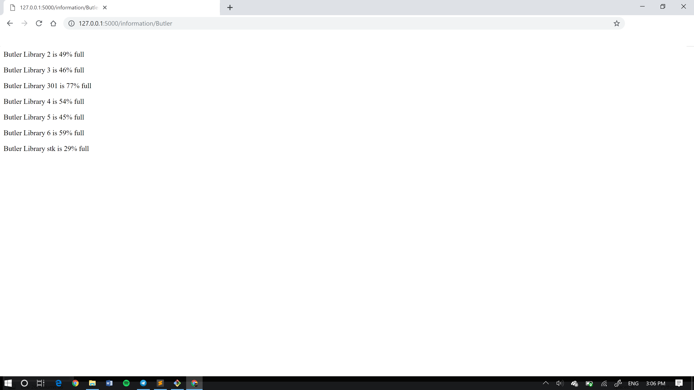
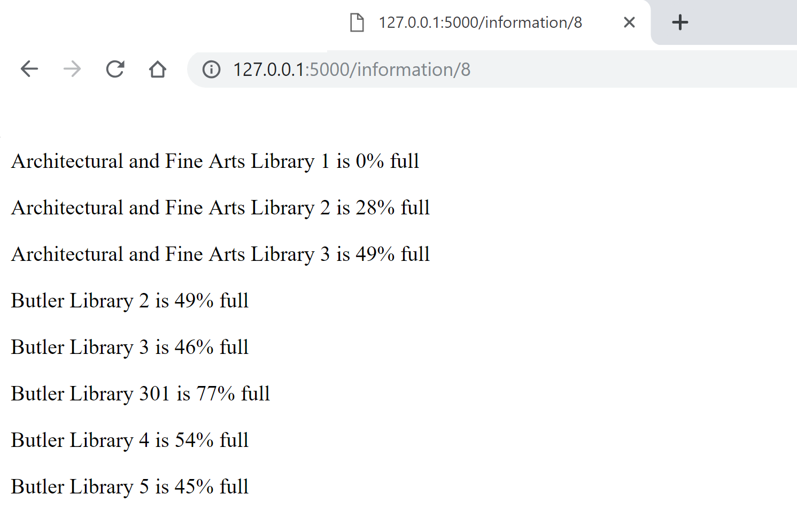

ADI Labs F'19 Technical Challenge
===================

We're excited to see that you're interested in joining ADI Labs for the Fall 2019 semester!

In Labs, we build products that are deployed and used by hundreds of students here at Columbia and beyond. To make sure you have enough technical experience to join the team, we've put together a quick technical challenge to assess your ability to use Flask, HTML/CSS, Git/GitHub, and basic data structures.
This diagnostic requires Python 3, a basic text editor (ex. Sublime/VS Code/TextEdit), Git (pre-installed on most computers), and a GitHub account. Please complete this challenge on your own.

The Problem
-------------
ADI wants to help the Columbia community during finals and midterms by telling them how crowded a specific library is, or what is the best place to study. To do so, we want to create a simple and "light" website based off [Density's](https://www.density.adicu.com) tools. 

Task 1
-------------
Fork this repository.

Task 2
-------------
Create a new branch from `master` and name it `dev` on your forked repo. Clone the repo (if you haven't already).

Task 3 (The important one)
-------------
On the dev branch, create a dynamic endpoint `/information/<query>`. A student queries this endpoint with a string that represents either a `number` or a `building_name`. Your task is, given a `building_name`, display how full that building is, and given a `number`, display the `number`-least crowded places, including how full they are. NOTE: Do NOT hardcode your API key obtained through density's website (however you solve this setback, make sure to specify it in the documentation).

For example, if I navigate to `localhost:5000/information/Butler`, my page will look like the following:

Take into account that the user may input building name with lowercase too, and the website should be flexible enough not to break with this small change (e.g. `localhost:5000/information/butler`).For the case where a `building_name` has whitespace (e.g. "Lehman Library"), you may assume that the url format will use underscores instead (e.g. "Lehman_Library"). You do not have to take into account input more malicious than those two cases.

Similarly, if I navigate to `localhost:5000/information/8`, my page will look like the following:

You will find these libraries and websites helpful in completing this task:
- [Requests](http://docs.python-requests.org/en/master/)
- [Density](https://www.density.adicu.com) -- specifically [this page](https://density.adicu.com/docs)
- [Buildings Info](https://density.adicu.com/docs/building_info)
- [Density API Docs](https://github.com/ADI-Labs/density/blob/master/API.md)

Task 4
-------------
In Labs, documentation is a vital part of our day-to-day experience. Make sure to provide good documentation for what you did!

Task 5
-------------
Commit your changes and push the new branch to your forked repository. Make sure that the changes are visible on the forked branch. When you've completed these steps, copy the link of your forked repo with the changes into your application. Thanks for completing the Labs challenge!

Questions
-------------
If you have any questions about this challenge and/or Labs, reach out to us at [labs@adicu.com](mailto:labs@adicu.com).
